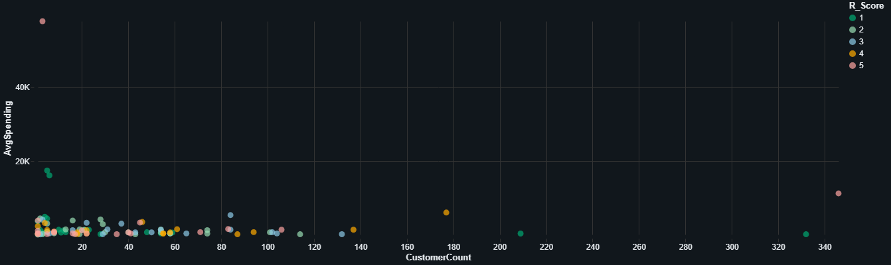

# Online Retail Data Analysis and Customer Segmentation

## Project Overview

This project provides a comprehensive data analysis pipeline for the "Online Retail" dataset from the UCI Machine Learning Repository. It uses PySpark and the Delta Lake framework within a Databricks environment to perform ETL (Extract, Transform, Load), data cleaning, enrichment, and advanced analytics.

The primary goal is to transform raw transactional data into actionable business insights, including customer segmentation using the RFM (Recency, Frequency, Monetary) model, product performance analysis, and time-series trends.

## Data Source

*   **Dataset:** Online Retail Data Set
*   **Source:** UCI Machine Learning Repository
*   **Link:** [https://archive.ics.uci.edu/ml/datasets/online+retail](https://archive.ics.uci.edu/ml/datasets/online+retail)

The script uses the `ucimlrepo` package to fetch the dataset directly.

## Medallion Architecture

The project follows the Medallion architecture to progressively refine the data:

*   **Bronze Layer (`online_retail_bronze`):** Ingests the raw data from the source and performs initial cleaning, such as correcting data types, handling nulls, and filtering invalid records (e.g., zero quantity or price).

*   **Silver Layer (`online_retail_silver`):** Enriches the data by adding valuable business features like time-based attributes (Year, Month, DayOfWeek), product categories, and weekend indicators. It also removes duplicate records to ensure data quality.

*   **Gold Layer (Analytics Tables):** Creates aggregated, business-ready tables for analytics and reporting. These tables include:
    *   `gold_customer_analytics`: Customer-level RFM scores and segments.
    *   `gold_product_performance`: Sales and popularity metrics for each product.
    *   `gold_sales_timeseries`: Aggregated sales data over time.
    *   `gold_geographic_performance`: Sales and customer metrics by country.
    *   `gold_daily_metrics`: Key performance indicators aggregated daily.

## Key Analyses and Features

### 1. RFM Customer Segmentation

Customers are segmented into distinct groups based on their purchasing behavior:
*   **Recency (R):** How recently a customer has purchased.
*   **Frequency (F):** How often they purchase.
*   **Monetary (M):** How much they spend.

**Customer Segments:**
*   **Champions:** Best customers; recent, frequent, and high-spending.
*   **Loyal Customers:** Regular and valuable customers.
*   **Potential Loyalists:** Recent customers with potential for growth.
*   **New Customers:** Recent, low-frequency buyers.
*   **Promising:** New customers with decent purchase potential.
*   **Need Attention:** Average customers who need activation.
*   **At Risk:** High-value customers who haven't purchased recently.
*   **Cannot Lose:** Mid-value customers at high risk of churning.
*   **Others:** All other combinations.

### 2. Product Performance Analytics

The `gold_product_performance` table ranks products based on:
*   Total revenue and quantity sold.
*   Number of unique customers and orders.
*   Popularity and revenue ranks.

### 3. Time Series and Geographic Analysis

The pipeline generates time-series data to analyze sales trends (daily, monthly) and geographic data to track performance by country.

## Technical Requirements

*   **Framework:** PySpark
*   **Environment:** Databricks
*   **Libraries:**
    *   `ucimlrepo`: To fetch the dataset.
    *   `pyspark`: For data manipulation and analysis.

## How to Run

This script is designed as a Databricks notebook.

1.  **Import:** Import the `.py` file into your Databricks workspace.
2.  **Installation:** The first cell in the notebook handles the installation of the required `ucimlrepo` library:
    ```python
    %pip install ucimlrepo --quiet
    dbutils.library.restartPython()
    ```
3.  **Execution:** Run the notebook cells sequentially. Each cell is titled to describe its function, from data ingestion (Bronze) to final analytics (Gold).
4.  **View Results:** The final cells generate visualizations and display summaries of the analysis directly in the notebook. The Gold tables are saved to the Databricks Hive metastore and can be queried for further analysis or dashboarding.

## Visualizations

Here are some of the visualizations generated from the analysis:

### Average Spending


### Monthly Orders


### Monthly Revenue


### Revenue By Customer Segment


### Top 15 Products


### Top RFM Combinations
